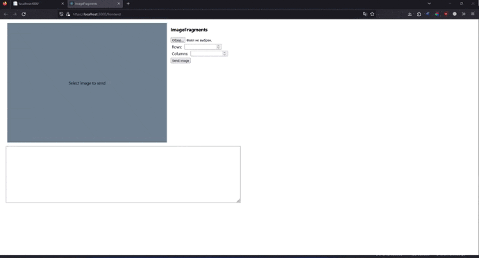

## Описание проекта

Это веб-приложение, разработанное на базе ASP.NET и React (Typescript), для разбиения изображения на фрагменты.

## Использование

- Выбрать изображение размером 1600x1200.
- Указать параметры разбиения (строки, столбцы).
- Отправить запрос на сервер.
- Полученные от сервера фрагменты изображения будут отображаться отдельном функциональном блоке (изменяемый размер, вертикальная прокрутка).
- Элементы, картинка которых находится в процессе подгрузки с сервера, отображаются серыми прямоугольниками

## Требования

- Серверная часть ASP.NET Core запускается из Visual Studio 2022.
- Клиентская часть React (Typescript)запускается через "start-clientapp.bat" из корневой папки проекта (открывает страницу клиента, запускает клиент).

## История изменений

### v2.0
- Полностью пересобран проект.
- Добавлена виртуализация.
- Добавлена задержка в 10мс между отправкой фрагментов на клиент для демонстрации подгрузки фрагментов.
### v2.1
- Загрузка отсутствующих компонентов "node_modules" выполняется перед сборкой проекта (инструкция прописана в ImageFragments.csproj).
- Удален файл "install-clientapp.bat".

## Скриншоты

